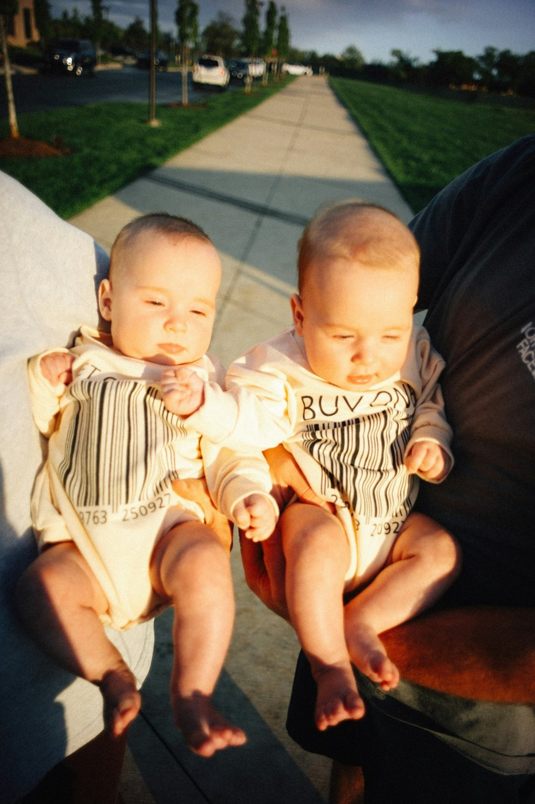

# Day 10 – Figma Inspired Hero (Twins Edition)

📅 วันที่เรียน: Day 10  
🎨 แนวทาง: แปลงภาพต้นแบบเป็น Hero Section แบบอิสระ โดยอิงจากดีไซน์ใน Figma แต่ไม่ลอกทั้งหมด

## 🔖 หัวข้อที่เรียนรู้แล้ว

| หัวข้อ Roadmap | เนื้อหา |
|----------------|---------|
| CSS-03 | Hero Layout, Flex Centering, Overlay |
| CSS-05 | Background Image vs `<picture>` |
| CSS-09 | Responsive Design (พื้นฐาน) |
| HTML-02 | Semantic: `<section>`, `<h1>`, `
`, `<button>` |
| HTML-03 | Image Handling + Accessibility |

---

## 💡 สิ่งที่ฝึกฝนในโปรเจกต์นี้

- สร้าง Hero Section ด้วย **background-image**
- วางข้อความแบบ overlay ให้ **อ่านง่าย**
- ใช้ **flexbox** จัดตำแหน่งกลางจอ
- ปรับปุ่ม CTA ให้น่าสนใจและคลิกได้จริง
- เข้าใจความต่างของ `<picture>` vs `background-image`

---

## 🌄 Preview

---

## 🧠 จุดเด่นของงานนี้

- 💬 ข้อความ: *Twice the Joy, Double the Love*
- 📷 ภาพพื้นหลัง: ภาพฝาแฝดพร้อมบาร์โค้ด (แนวคิดสื่อความรักและความพิเศษ)
- 🧱 โครงสร้าง HTML + CSS พร้อมต่อยอดเป็นเว็บจริง
- ✅ พร้อมใช้ใน Portfolio และสามารถดัดแปลงได้หลายแนว

---

## 🧪 โค้ดที่เขียนเอง

- `Twin.html` – หน้าเว็บหลัก
- `Twin-styles.css` – สไตล์ของ Hero Section
- `preview.jpg` – ภาพที่ใช้แสดงบนหน้า

---

## ✅ ต่อไปทำอะไรได้อีก?

- [ ] เพิ่ม Responsive ด้วย Media Query
- [ ] ลองทำ Section ถัดไป เช่น Feature หรือ Footer
- [ ] ทดลองทำเวอร์ชัน Tailwind CSS
- [ ] ใส่ animation ให้ปุ่ม CTA

---

## 📚 แหล่งแรงบันดาลใจ

- [Figma Design Template](https://www.figma.com/community)
- [ภาพจาก User Upload – ฝึกสื่อความรู้สึกผ่านดีไซน์]
